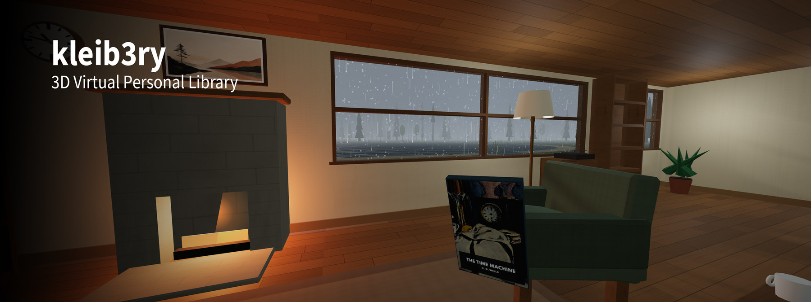

# kleib3ry — 3D Virtual Personal Library



**[Demo Video](https://youtu.be/K24UOcMVpto)** — a walk through the library.

Imagine going into a game-like 3D environment, picking up a book from your ebook collection and browsing through it. Imagine sitting in a virtual lakeside cabin reading PDFs and EPUBs and annotating them. Imagine browsing your ebook collection in virtual bookshelves rather than folders on your computer. Imagine having a virtual cat bringing you random books to read.

This, at its core, is what this project is all about. I started building it after a conversation on the fact that there's a stark difference between a collection of physical books and of digital books – we rarely browse through the digital ones.

Please be aware that this is a fun little side project – a (tech) demo for something I would like to have; something I would love someone else to build in a fully-fledged, more beautiful way.

## Some Noteworthy Features

- Libraries (or savegames) are purely text-based and can be put under version control.
- Maps can be defined and hence designed by changing the `library.json` in the `.library` folder within a library. The default map is a lakeside cabin in the woods, and the room reloads while you are standing in it.
- Nothing shelves itself. A scan stacks your books in moving boxes on the floor; unpacking and sorting is something for you to do.
- There is a cat and a delivery person; they can deliver food (not real), random books as well as arXiv papers freshly downloaded from the internet.
- It is not only about books: Records (audio files) for the record player, pictures for the frames, tapes (video files) for the television, and an arcade machine that is a real CHIP-8 interpreter.

## Getting Your Own Library

### There are Two Ways to Run It

Both are the same program over the same library folder — see [docs/modes.md](docs/modes.md).
The desktop app is built and released for **Windows**; on macOS and Linux the
container is the way in, and it is the same room in a browser tab.

#### Desktop Application

The easiest way to get started is to download the current release
([`kleib3ry.exe`](https://github.com/IngoKl/library/releases/latest)) and point it
towards the demo library.

If you want to go the "developer route", start like this:

```bash
npm install
npm run assets
npm run tauri:dev
```

Then **Choose Folder…**, then **Scan**.

`npm run tauri:build` makes a Windows installer and a standalone `.exe`.

#### Hosted Web-Application

**Hosted, in a container** — the same library served to a browser:

```bash
docker build -t kleib3ry .
docker run --rm -p 127.0.0.1:8080:8080 -v /path/to/your/library:/library kleib3ry
```

Open <http://localhost:8080> and press **Scan** once. There are no accounts and no
TLS, so it is bound to this machine above; opening it to the rest of the house is
`-p 8080:8080`, and a decision worth making deliberately
([docs/docker.md](docs/docker.md)).

### There is a Demo Library

[`demo-data/demo-library/`](demo-data/demo-library/) is a complete, freely-licensed
library folder: ten [Standard Ebooks](https://standardebooks.org/) titles, two
records, two pictures, a tape and a Pong cartridge. Point the desktop app at it,
or mount it:

```bash
docker run --rm -p 127.0.0.1:8080:8080 -v "$PWD/demo-data/demo-library:/library" kleib3ry
```

Credits and licences in [its own README](demo-data/demo-library/README.md) — that
folder is other people's work and is not covered by this project's MIT licence.

### Your Library Folder

The application runs on top of a library folder. This folder contains, for example, books, music and videos. It also contains the current state of the virtual library, the "savegame."

```text
My Library/
  books/        your PDFs and EPUBs
  music/        one record per file
  artwork/      one picture per file
  video/        one tape per file
  roms/         one game cartridge per .ch8 file
  .library/     everything the app writes — created for you
```

Only `books/` is needed. The app never writes among your books and never rewrites
`library.json`. See [docs/library-folder.md](docs/library-folder.md).
